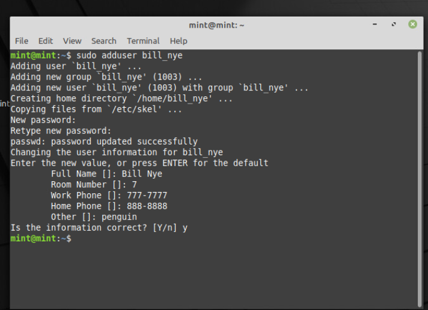

# INSTRUCTIONS FOR SSH LOGIN TO LINUX SERVER


## PURPOSE - To achieve the goal of creating a user on a Linux server, adding SSH keys from your laptop to that server user, and enabling SSH access without a password


## STEPS 


 
### Step 1: Create a User on the Linux Server


First, you need to create a user on the Linux server. You can do this by using the `useradd` command. Replace `newuser` with the desired username:

```bash


sudo useradd newuser


```


Set a password for the new user. Replace `newuser` with the username you just created:

```bash
sudo passwd newuser


```


An example using alternate command ```adduser```  is [here](./indycium_doc_prep.png). This command is more user friendly. 




### Step 2: Generate SSH Key Pair on Your Laptop


On your laptop, generate an SSH key pair using the `ssh-keygen` command. This creates a private key (`id_rsa`) and a public key (`id_rsa.pub`). You can specify a passphrase for added security, but pressing Enter without typing anything will create a key without a passphrase.

```bash
ssh-keygen -t rsa -b 4096 -C "your_email@example.com"
```

Follow the prompts to save the keys. By default, they are saved in the `.ssh` directory under your home directory.

-t helps in selecting the encryption algorithm


-b decides key length or size


-c or -C sets the comment we provide for the ssh key

Something like this may appear 


```bash


Your identification has been saved in /home/username/.ssh/id_rsa.
Your public key has been saved in /home/username/.ssh/id_rsa.pub.
The key fingerprint is:
a9:49:EX:AM:PL:E3:3e:a9:de:4e:77:11:58:b6:90:26 username@203.0.113.0
The key's randomart image is:
+--[ RSA 2048]----+
|     ..o         |
|   E o= .        |
|    o. o         |
|        ..       |
|      ..S        |
|     o o.        |
|   =o.+.         |
|. =++..          |
|o=++.            |
+-----------------+


```

### Step 3: Copy the Public Key to the Server


Now, you need to copy the public key to the server. You can use the `ssh-copy-id` command for this purpose. Replace `newuser` with the username you created earlier, and `server_ip_address` with the actual IP address of your server:

```bash
ssh-copy-id newuser@server_ip_address
```

This command copies the public key to the `~/.ssh/authorized_keys` file on the server, allowing passwordless login.

### Step 4: Test SSH Access Without a Password


Finally, test the SSH access to ensure it works without a password. Use the `ssh` command again, replacing `newuser` with the username and `server_ip_address` with the server's IP address:

```bash

ssh newuser@server_ip_address


```

If everything is set up correctly, you should be logged in without being asked for a password.


## References


- https://www.linkedin.com/pulse/adduser-useradd-creating-users-linux-shannon-houska/
- https://www.ssh.com/academy/ssh/copy-id
- https://www.digitalocean.com/community/tutorials/how-to-configure-ssh-key-based-authentication-on-a-linux-server

